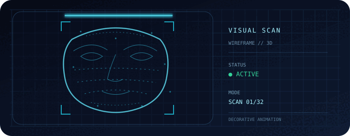

<h1>Hi, I'm Udit Kumar 👋</h1>

 

  I'm Udit Kumar. This is where I share projects, experiments, and things I learn along the way.

---

### About

Welcome to my GitHub profile. I’m using this space to build, share, and keep improving—one project at a time.

### GitHub stats

  
  

### 3D contribution graph

<!-- Generated daily by .github/workflows/profile-3d.yml -->
<picture>
  <source media="(prefers-color-scheme: dark)" srcset="profile-3d-contrib/profile-night-rainbow.svg" />
  <source media="(prefers-color-scheme: light)" srcset="profile-3d-contrib/profile-green.svg" />
  
</picture>

### Find me

---

  Thanks for stopping by — have a good one! ✨

